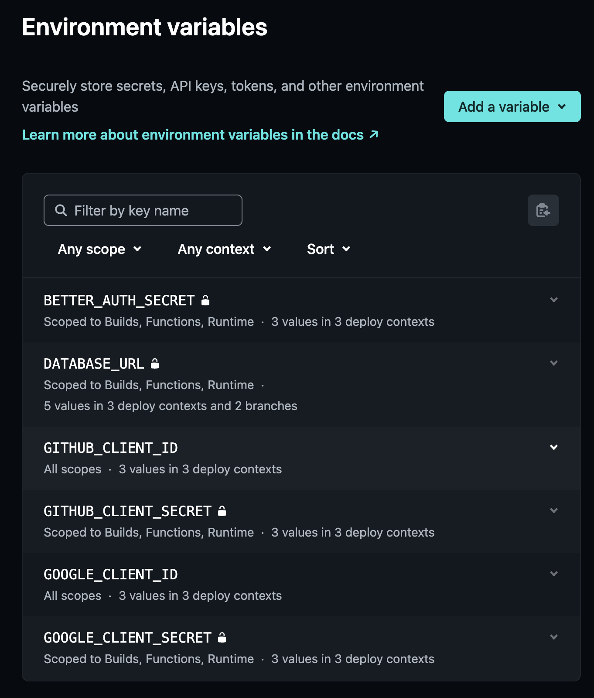

# [フルスタック Tanstack Starter🏝️]()

フルスタックTypeScript/ReactフレームワークのTanstack Startを素早く立ち上げ、デプロイするためのテンプレート

## 使用技術

- [React 19](https://react.dev) + [React Compiler](https://react.dev/learn/react-compiler)
- TanStack [Start](https://tanstack.com/start/latest) + [Router](https://tanstack.com/router/latest) + [Query](https://tanstack.com/query/latest)
- [Tailwind CSS v4](https://tailwindcss.com/) + [shadcn/ui](https://ui.shadcn.com/)
- [Drizzle ORM](https://orm.drizzle.team/) + PostgreSQL on [Neon DB](https://neon.com/)
- [Better Auth](https://www.better-auth.com/)
- deployed on [Netlify](https://www.netlify.com/)

## アーキテクチャ

### デフォルトのディレクトリ構造

```
src/
├── routes/                   # 柔軟にMixed Flat and Directory Routes方式でファイルベースルーティングを行う（詳細はtanstack-router.mdcに定義）
│   ├── __root.tsx            # ルートレイアウト・グローバル設定
│   ├── index.tsx             # 認証保護なしのランディングホームページ
│   ├── (auth)/               # 認証関連のルートグループ
│   │   ├── route.tsx         # 認証レイアウト
│   │   ├── login.tsx         # ログインページ
│   │   └── signup.tsx        # サインアップページ
│   ├── dashboard/            # 認証保護下のパス例(/dashboardパス)
│   │   ├── route.tsx         # パスレイアウト
│   │   ├── index.tsx         # パスホーム
│   │   └── $userId.tsx       # 動的ユーザーページ
│   └── api/                  # API Route
│       └── auth/             # 認証関連
│           └── $.ts          # 認証API（Better Auth）
├── db/                      # 主にDrizzleORM関連
│   ├── schema.ts            # Drizzleスキーマ
│   ├── index.ts             # DBインスタンス設定
├── styles/                  # スタイリング関連
│   ├── app.css              # プロジェクトの統一的なCSS
├── lib/                     # プロジェクト固有の再利用可能なコード
│   ├── server-functions/    # 主にDrizzleスキーマで定義したEntityごとのServer Functions
│   |   ├── comments.ts      # コメント関連CRUD
│   |   └── posts.tsx        # ポスト関連CRUD
│   ├── middlewares.ts       # Tanstack StartのMiddleware
│   ├── auth.ts              # Better Auth設定ファイル
│   ├── auth-client.ts       # Better Authが提供する認証関連メソッド（signin, signoutなど）
│   └── utils.ts             # 一般的なユーティリティヘルパー関数
└── components/              # 再利用可能コンポーネント
    ├── ui/                  # 再利用可能でPrimitiveなUIコンポーネント群（主にShadcn/uiが提供するもの）
    └── */**/*.tsx           # カスタムコンポーネント
```

## Project Rules

このテンプレートでは、[Cursor Project Rules](https://docs.cursor.com/context/rules#project-rules)を活用して、TanStack エコシステムの開発ベストプラクティスを体系化・自動生成することに挑戦しています。

### 📁 Rule構成

```text
.cursor/rules/
├── react.mdc                     # React 19 + Compiler 原則
├── tanstack-integration.mdc      # TanStack エコシステム統合
├── tanstack-start.mdc            # TanStack Start機能関連
├── tanstack-router.mdc           # TanStack Router機能関連
├── project-architecture.mdc      # プロジェクト構造・設計原則
├── drizzle-zod.mdc               # Drizzle ORM + drizzle-zod統合
├── ui.mdc                        # Tailwind v4 + shadcn/ui + アクセシビリティ
├── typescript.mdc                # TypeScript/JavaScript 規約
└── testing.mdc                   # Vitest テスト戦略（未定義・未実装）
```

## 🚀 ブランチ・CD運用戦略

GitFlowブランチ戦略とそれに紐づいた自動的なビルドによるCD運用戦略

### 🔄 GitFlow ブランチ戦略

```text
main (本番環境)
 ↑
develop (各機能ブランチの統一マージ先であるプレビュー環境)
 ↑
feature/fix/* (機能開発・修正ブランチ)
```

#### **feature/fix ブランチ（個人開発環境）**

- `develop`ブランチから派生して作成
- 開発者個人がローカルで作業を進める専用ブランチ
- DBは**Docker Compose PostgreSQL**を使用（完全分離環境）
- リポジトリにプッシュすればNetlifyのBranch Deploy機能でブランチ専用プレビューURLを生成可能
- 作業完了後、`develop`ブランチへのPRを作成する

#### **develop ブランチ（プレビュー環境）**

- 全ての feature/fix ブランチが統合されるプレビュー環境
- DBはリモート上にある**NeonDBのdevelopment**ブランチを使用
- GitHub Actions + Netlify Deploy PreviewsでCDパイプラインを構築

#### **main ブランチ（本番環境）**

- 本番リリース用のブランチ
- DBはリモート上にある**NeonDBのproduction**ブランチを使用
- GitHub Actions + Netlify ProductionでCDパイプラインを構築

### 🏗️ 環境別自動ビルド戦略

#### **ローカル開発環境（feature/fixなど開発・修正ブランチ）**

**トリガー:**

- リモートリポジトリへプッシュ

**自動実行:**

1. **Netlify Branch Deploy** → ブランチ専用プレビューURL生成

#### **プレビュー環境（develop ブランチ）**

**トリガー:**

- `develop`ブランチへの直接プッシュ
- feature/fixなど開発・修正ブランチからのPR作成時

**自動実行:**

1. **Netlify Deploy Previews** → プレビュー専用URLでビルド
2. **GitHub Actions** (`migrate-preview-db.yml`) → Neon development DBマイグレーション

#### **本番環境（main ブランチ）**

**トリガー:**

- `main`ブランチへのプッシュ（PRマージ含む）

**自動実行:**

1. **Netlify Production** → 本番URLでビルド
2. **GitHub Actions** (`migrate-production-db.yml`) → Neon production DBマイグレーション

### 💾 データベース運用戦略

環境ごとに完全分離されたデータベース運用：

| 環境           | ブランチ       | データベース              | 接続方法               |
| -------------- | -------------- | ------------------------- | ---------------------- |
| **ローカル**   | feature/fix/\* | Docker Compose PostgreSQL | `NODE_ENV=development` |
| **プレビュー** | develop        | Neon DB (development)     | `NODE_ENV=production`  |
| **本番**       | main           | Neon DB (production)      | `NODE_ENV=production`  |

#### **環境変数によるデータベース接続の自動切り替え**

```typescript
// src/db/index.ts
export const db: Database =
  process.env.NODE_ENV === "development"
    ? createLocalDb() // Docker Compose
    : createNeonDb(); // Neon (preview/production)
```

#### **開発時のDBワークフロー**

```zsh
# 1. ローカルDB起動
docker-compose up -d

# 2. 開発中（高速イテレーション）
pnpm drizzle-kit push    # ローカルDBに直接反映

# 3. 開発完了時（PR準備）
pnpm drizzle-kit generate # マイグレーションファイル生成
```

### ⚙️ 環境変数設定ガイド

#### **Netlifyダッシュボードにてコンテキスト別に設定すべき環境変数:**

| 変数名                 | 設定コンテキスト | 値                        |
| ---------------------- | ---------------- | ------------------------- |
| `DATABASE_URL`         | Production       | Neon `Production` DB URL  |
|                        | Deploy Previews  | Neon `Development` DB URL |
|                        | Branch deploys   | Neon `Development` DB URL |
| `BETTER_AUTH_SECRET`   | All contexts     | Strong secret key         |
| `GITHUB_CLIENT_ID`     | All contexts     | GitHub OAuth App ID       |
| `GITHUB_CLIENT_SECRET` | All contexts     | GitHub OAuth App Secret   |
| `GOOGLE_CLIENT_ID`     | All contexts     | Google OAuth App ID       |
| `GOOGLE_CLIENT_SECRET` | All contexts     | Google OAuth App Secret   |



- [Github](https://www.better-auth.com/docs/authentication/github) OAuth
- [Google](https://www.better-auth.com/docs/authentication/google) OAuth

#### **設定スコープ**

- **Scopes**: `Builds, Functions, Runtime` (全スコープ)
- **コンテキスト別設定**: Production / Deploy Previews / Branch deploys

**📋 設定例:**

> **💡 ヒント**: 環境変数設定後、Deploy Preview や Production ビルドで接続確認を行い、GitHub Actions のマイグレーション実行ログで正常性を検証してください。

## 🔐 Better Auth + Drizzle ORM による認証基盤

### 実装済み基盤

- ✅ サインイン・サインアップフォーム、サインアウトボタン
- ✅ OAuth認証（Google, GitHub）
- ✅ Email/Password認証
- ✅ PostgreSQL + Drizzle ORM でのセッション管理
- ✅ TanStack Router Context統合
- ✅ Server Functions認証ミドルウェア

### 📋 開発フロー

#### **Better Auth設定変更時**

```bash
# Better Auth CLI でスキーマ更新
pnpm auth:generate

# 新しいマイグレーション生成・適用
pnpm drizzle-kit generate
pnpm drizzle-kit migrate
```

### 🏗️ Drizzleスキーマが唯一の参照元

すべてのエンティティ設計定義とそれに依存するZodスキーマ生成とTS型生成を `src/db/schema.ts` で一元管理（詳細は`drizzle-zod.mdc`ルールを参照）：

- Better Auth認証テーブル
- アプリケーションテーブル
- リレーション定義
- Zodスキーマ生成
- TS型生成
